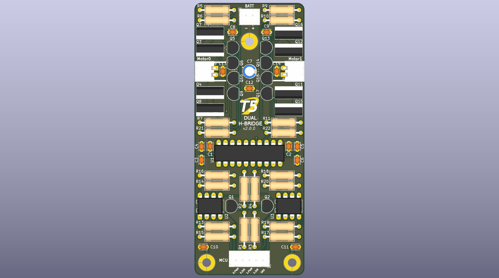
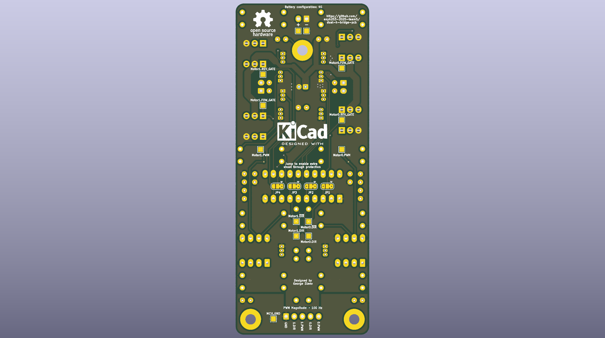
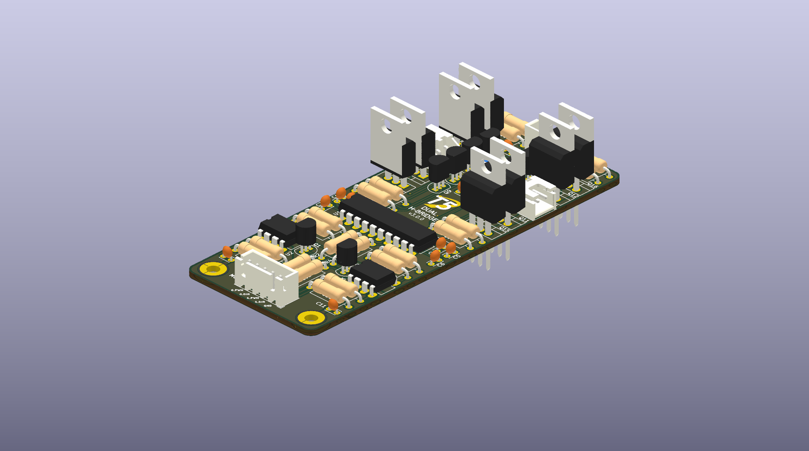

# Dual H-Bridge PCB

Dual h-bridge design with a PWM signal and direction bit for controlling two motors.

Similar to Greg Reid's 2025 h-bridge design, without relying on tripping the overcurrent protection. Instead, this design duplicates the incoming PWM signal, sends one to each of the low side h-bridge MOSFETs, then pulls the gate with the enhanced high side MOSFET low (avoiding shoot-through). 

Based on many factors (motor inertia, gate driver response, optocoupler distortion) the PWM frequency should be limited on the order of 100 Hz.
Intended motor battery configuration of 4S.

**BOM, Schematic, and PCB drawings in the latest release.**

## Images

Designed by George Sleen.
